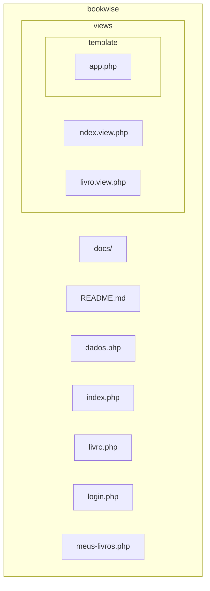

# Estrutura do Projeto

A seguir está a estrutura de diretórios e arquivos do projeto:

```mermaid
flowchart TB
     subgraph bookwise
         docs[docs/]
         README[README.md]
         dados[dados.php]
         index[index.php]
         livro[livro.php]
         login[login.php]
         meus_livros[meus-livros.php]
         views[views/]
     end
     subgraph views
         index_view[index.view.php]
         livro_view[livro.view.php]
         template[template/]
     end
     subgraph template
         app[app.php]
     end
```